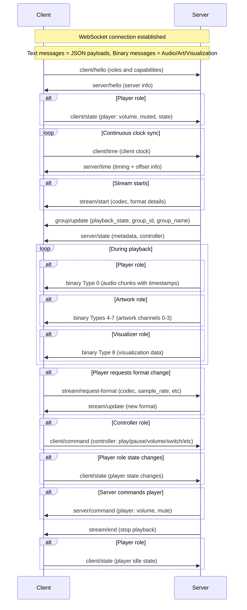

# The Resonate Protocol

_This is raw, unfiltered and experimental._

Resonate is a multi-room music experience protocol. The goal of the protocol is to orchestrate all devices that make up the music listening experience. This includes outputting audio on multiple speakers simultaneously, screens and lights visualizing the audio or album art, and wall tablets providing media controls.

## Definitions

- **Resonate Server** - orchestrates all devices, generates audio streams, manages players and clients, provides metadata
- **Resonate Client** - a client that can play audio, visualize audio, display metadata, or provide music controls. Has different possible roles (player, metadata, controller, artwork, visualizer). Every client has a unique identifier
  - **Player** - receives audio and plays it in sync. Has its own volume and mute state and preferred format settings
  - **Controller** - controls the Resonate group this client is part of
  - **Metadata** - displays text metadata (title, artist, album, etc.)
  - **Artwork** - displays artwork images. Has preferred format for images
  - **Visualizer** - visualizes music. Has preferred format for audio features
- **Resonate Group** - a group of clients. Each client belongs to exactly one group, and every group has at least one client. Every group has a unique identifier. Each group has the following states: list of member clients, volume, mute, and playback state
- **Resonate Stream** - client-specific details on how the server is formatting and sending binary data. Each client receives its own independently encoded stream based on its capabilities and preferences. For players, the server sends audio chunks as far ahead as the client's buffer capacity allows. For artwork clients, the server sends album artwork and other visual images through the stream

## Establishing a Connection

Resonate has two standard ways to establish connections: Server and Client initiated.

Resonate Servers must support both methods described below.

### Server Initiated Connections

Clients announce their presence via mDNS using:
- Service type: `_resonate._tcp.local.`
- Port: The port the Resonate client is listening on (recommended: `8927`)
- TXT record: `path` key specifying the WebSocket endpoint (recommended: `/resonate`)

The server discovers available clients through mDNS and connects to each client via WebSocket using the advertised address and path.

**Note:** Do not manually connect to servers if you are advertising `_resonate._tcp`.

### Client Initiated Connections

If clients prefer to initiate the connection instead of waiting for the server to connect, the server must be discoverable via mDNS using:
- Service type: `_resonate-server._tcp.local.`
- Port: The port the Resonate server is listening on (recommended: `8927`)
- TXT record: `path` key specifying the WebSocket endpoint (recommended: `/resonate`)

Clients discover the server through mDNS and initiate a WebSocket connection using the advertised address and path.

**Note:** Do not advertise `_resonate._tcp` if the client plans to initiate the connection.

**Note:** After this point, Resonate works independently of how the connection was established. The Resonate client is always the consumer of data like audio or metadata, regardless of who initiated the connection.

While custom connection methods are possible for specialized use cases (like remotely accessible web-browsers, mobile apps), most clients should use one of the two standardized methods above if possible.

## Communication

Once the connection is established, Client and Server are going to talk.

The first message must always be a `client/hello` message from the client to the server.
Once the server receives this message, it responds with a `server/hello` message. Before this handshake is complete, no other messages should be sent.

WebSocket text messages are used to send JSON payloads.

**Note:** In field definitions, `?` indicates an optional field (e.g., `field?`: type means the field may be omitted).

All messages have a `type` field identifying the message and a `payload` object containing message-specific data. The payload structure varies by message type and is detailed in each message section below.

Message format example:

```json
{
  "type": "stream/start",
  "payload": {
    "player": {
      "codec": "opus",
      "sample_rate": 48000,
      "channels": 2,
      "bit_depth": 16
    },
    "artwork": {
      "channels": [
        {
          "source": "album",
          "format": "jpeg",
          "width": 800,
          "height": 800
        }
      ]
    }
  }
}
```

WebSocket binary messages are used to send audio chunks, media art, and visualization data. The first byte is a uint8 representing the message type.

### Binary Message ID Structure

Binary message IDs organize bits into fields: **bits 7-2** identify the role type, **bits 1-0** identify the message slot within that role. This allocates 4 message slots per role.

**Role assignments:**
- `000000xx` (0-3): Player role
- `000001xx` (4-7): Artwork role
- `000010xx` (8-11): Visualizer role

**Message slots within each role:**
- Slot 0: `xxxxxx00`
- Slot 1: `xxxxxx01`
- Slot 2: `xxxxxx10`
- Slot 3: `xxxxxx11`

## Clock Synchronization

Clients continuously send `client/time` messages to maintain an accurate offset from the server's clock. The frequency of these messages is determined by the client based on network conditions and clock stability.

Binary audio messages contain timestamps in the server's time domain indicating when the audio should be played. Clients use their computed offset to translate server timestamps to their local clock for synchronized playback.

## Playback Synchronization

- Each client is responsible for maintaining synchronization with the server's timestamps
- Clients maintain accurate sync by adding or removing samples using interpolation to compensate for clock drift
- When a client cannot maintain sync (e.g., buffer underrun), it should mute its audio output and continue buffering until it can resume synchronized playback
- The server is unaware of individual client synchronization accuracy - it simply broadcasts timestamped audio
- The server sends audio to late-joining clients with future timestamps only, allowing them to buffer and start playback in sync with existing clients
- Audio chunks may arrive with timestamps in the past due to network delays or buffering; clients should drop these late chunks to maintain sync



## Core messages
This section describes the fundamental messages that establish communication between clients and the server. These messages handle initial handshakes, ongoing clock synchronization, stream lifecycle management, and role-based state updates and commands.

Every Resonate client and server must implement all messages in this section regardless of their specific roles. Role-specific object details are documented in their respective role sections and need to be implemented only if the client supports that role.

### Client → Server: `client/hello`

First message sent by the client after establishing the WebSocket connection. Contains information about the client's capabilities and roles.
This message will be followed by a [`server/hello`](#server--client-serverhello) message from the server.

Players that can output audio should have the role `player`.

- `client_id`: string - uniquely identifies the client for groups and de-duplication
- `name`: string - friendly name of the client
- `device_info?`: object - optional information about the device
  - `product_name?`: string - device model/product name
  - `manufacturer?`: string - device manufacturer name
  - `software_version?`: string - software version of the client (not the Resonate version)
- `version`: integer - version that the Resonate client implements
- `supported_roles`: string[] - at least one of:
  - `player` - outputs audio
  - `controller` - controls the current Resonate group
  - `metadata` - displays text metadata describing the currently playing audio
  - `artwork` - displays artwork images
  - `visualizer` - visualizes audio
- `player_support?`: object - only if `player` role is set ([see player support object details](#client--server-clienthello-player-support-object))
- `artwork_support?`: object - only if `artwork` role is set ([see artwork support object details](#client--server-clienthello-artwork-support-object))
- `visualizer_support?`: object - only if `visualizer` role is set ([see visualizer support object details](#client--server-clienthello-visualizer-support-object))

### Client → Server: `client/time`

Sends current internal clock timestamp (in microseconds) to the server.
Once received, the server responds with a [`server/time`](#server--client-servertime) message containing timing information to establish clock offsets.

- `client_transmitted`: integer - client's internal clock timestamp in microseconds

### Server → Client: `server/hello`

Response to the [`client/hello`](#client--server-clienthello) message with information about the server.

Only after receiving this message should the client send any other messages (including [`client/time`](#client--server-clienttime) and the initial [`client/state`](#client--server-clientstate) message if the client has roles that require state updates).

- `server_id`: string - identifier of the server
- `name`: string - friendly name of the server
- `version`: integer - latest supported version of Resonate

### Server → Client: `server/time`

Response to the [`client/time`](#client--server-clienttime) message with timestamps to establish clock offsets.

For synchronization, all timing is relative to the server's monotonic clock. These timestamps have microsecond precision and are not necessarily based on epoch time.

- `client_transmitted`: integer - client's internal clock timestamp received in the `client/time` message
- `server_received`: integer - timestamp that the server received the `client/time` message in microseconds
- `server_transmitted`: integer - timestamp that the server transmitted this message in microseconds

### Client → Server: `client/state`

Client sends state updates to the server. Contains role-specific state objects based on the client's supported roles.

Must be sent immediately after receiving [`server/hello`](#server--client-serverhello) for roles that report state (such as `player`), and whenever any state changes thereafter.

For the initial message, include all state fields. For subsequent updates, only include fields that have changed. The server will merge these updates into existing state.

- `player?`: object - only if client has `player` role ([see player state object details](#client--server-clientstate-player-object))

### Client → Server: `client/command`

Client sends commands to the server. Contains command objects based on the client's supported roles.

- `controller?`: object - only if client has `controller` role ([see controller command object details](#client--server-clientcommand-controller-object))

### Server → Client: `server/state`

Server sends state updates to the client. Contains role-specific state objects.

Only include fields that have changed. The client will merge these updates into existing state. Fields set to `null` should be cleared from the client's state.

- `metadata?`: object - only sent to clients with `metadata` role ([see metadata state object details](#server--client-serverstate-metadata-object))
- `controller?`: object - only sent to clients with `controller` role ([see controller state object details](#server--client-serverstate-controller-object))

### Server → Client: `server/command`

Server sends commands to the client. Contains role-specific command objects.

- `player?`: object - only sent to clients with `player` role ([see player command object details](#server--client-servercommand-player-object))

### Server → Client: `stream/start`

When a new stream starts.

- `player?`: object - only sent to clients with the `player` role ([see player object details](#server--client-streamstart-player-object))
- `artwork?`: object - only sent to clients with the `artwork` role ([see artwork object details](#server--client-streamstart-artwork-object))
- `visualizer?`: object - only sent to clients with the `visualizer` role ([see visualizer object details](#server--client-streamstart-visualizer-object))

### Server → Client: `stream/update`

Sent when the format of the binary stream changes. Contains delta updates with only the changed fields. The client should merge these updates into the existing stream configuration.

- `player?`: object - only sent to clients with the `player` role ([see player object details](#server--client-streamupdate-player-object))
- `artwork?`: object - only sent to clients with the `artwork` role ([see artwork object details](#server--client-streamupdate-artwork-object))
- `visualizer?`: object - only sent to clients with the `visualizer` role ([see visualizer object details](#server--client-streamupdate-visualizer-object))

### Client → Server: `stream/request-format`

Request different stream format (upgrade or downgrade). Available for clients with the `player` or `artwork` role.

- `player?`: object - only for clients with the `player` role ([see player object details](#client--server-streamrequest-format-player-object))
- `artwork?`: object - only for clients with the `artwork` role ([see artwork object details](#client--server-streamrequest-format-artwork-object))

Response: [`stream/update`](#server--client-streamupdate) with the new format for the requested role(s).

**Note:** Clients should use this message to adapt to changing network conditions, CPU constraints, or display requirements. The server maintains separate encoding for each client, allowing heterogeneous device capabilities within the same group.

### Server → Client: `stream/end`

Indicates the stream has ended.

Clients with the `player` role should stop playback and clear buffers.

Clients with the `visualizer` role should stop visualizing and clear buffers.

No payload.

### Server → Client: `group/update`

State update of the group this client is part of.

Contains delta updates with only the changed fields. The client should merge these updates into existing state. Fields set to `null` should be cleared from the client's state.

- `playback_state?`: 'playing' | 'paused' | 'stopped' - playback state of the group
- `group_id?`: string - group identifier
- `group_name?`: string - friendly name of the group


## Player messages
This section describes messages specific to clients with the `player` role, which handle audio output and synchronized playback. Player clients receive timestamped audio data, manage their own volume and mute state, and can request different audio formats based on their capabilities and current conditions.

### Client → Server: `client/hello` player support object

The `player_support` object in [`client/hello`](#client--server-clienthello) has this structure:

- `player_support`: object
  - `support_formats`: object[] - list of supported audio formats in priority order (first is preferred)
    - `codec`: 'opus' | 'flac' | 'pcm' - codec identifier
    - `channels`: integer - supported number of channels (e.g., 1 = mono, 2 = stereo)
    - `sample_rate`: integer - sample rate in Hz (e.g., 44100)
    - `bit_depth`: integer - bit depth for this format (e.g., 16, 24)
  - `buffer_capacity`: integer - max size in bytes of compressed audio messages in the buffer that are yet to be played
  - `supported_commands`: string[] - subset of: 'volume', 'mute'

### Client → Server: `client/state` player object

The `player` object in [`client/state`](#client--server-clientstate) has this structure:

Informs the server of player state changes. Only for clients with the `player` role.

State updates must be sent whenever any state changes, including when the volume was changed through a `server/command` or via device controls.

- `player`: object
  - `state`: 'synchronized' | 'error' - state of the player, should always be `synchronized` unless there is an error preventing current or future playback (unable to keep up, issues keeping the clock in sync, etc)
  - `volume`: integer - range 0-100
  - `muted`: boolean - mute state

### Client → Server: `stream/request-format` player object

The `player` object in [`stream/request-format`](#client--server-streamrequest-format) has this structure:

- `player`: object
  - `codec?`: 'opus' | 'flac' | 'pcm' - requested codec identifier
  - `channels?`: integer - requested number of channels (e.g., 1 = mono, 2 = stereo)
  - `sample_rate?`: integer - requested sample rate in Hz (e.g., 44100, 48000)
  - `bit_depth?`: integer - requested bit depth (e.g., 16, 24)

Response: [`stream/update`](#server--client-streamupdate) with the new format.

**Note:** Clients should use this message to adapt to changing network conditions or CPU constraints. The server maintains separate encoding for each client, allowing heterogeneous device capabilities within the same group.

### Server → Client: `server/command` player object

The `player` object in [`server/command`](#server--client-servercommand) has this structure:

Request the player to perform an action, e.g., change volume or mute state.

- `player`: object
  - `command`: 'volume' | 'mute' - must be one of the values listed in `supported_commands` in the [`player_support`](#client--server-clienthello-player-support-object) object in the [`client/hello`](#client--server-clienthello) message
  - `volume?`: integer - volume range 0-100, only set if `command` is `volume`
  - `mute?`: boolean - true to mute, false to unmute, only set if `command` is `mute`

### Server → Client: `stream/start` player object

The `player` object in [`stream/start`](#server--client-streamstart) has this structure:

- `player`: object
  - `codec`: string - codec to be used
  - `sample_rate`: integer - sample rate to be used
  - `channels`: integer - channels to be used
  - `bit_depth`: integer - bit depth to be used
  - `codec_header?`: string - Base64 encoded codec header (if necessary; e.g., FLAC)

### Server → Client: `stream/update` player object

The `player` object in [`stream/update`](#server--client-streamupdate) has this structure with delta updates:

- `player`: object
  - `codec?`: string - codec to be used
  - `sample_rate?`: integer - sample rate to be used
  - `channels?`: integer - channels to be used
  - `bit_depth?`: integer - bit depth to be used
  - `codec_header?`: string - Base64 encoded codec header (if necessary; e.g., FLAC)

### Server → Client: Audio Chunks (Binary)

Binary messages should be rejected if there is no active stream.

- Byte 0: message type `0` (uint8)
- Bytes 1-8: timestamp (big-endian int64) - server clock time in microseconds when the first sample should be output by the device
- Rest of bytes: encoded audio frame

The timestamp indicates when the first audio sample in this chunk should be sent to the device or speaker's audio output. Clients must translate this server timestamp to their local clock using the offset computed from clock synchronization.

## Controller messages
This section describes messages specific to clients with the `controller` role, which enables the client to control the Resonate group this client is part of, and switch between groups.

Every client which lists the `controller` role in the `supported_roles` of the `client/hello` message needs to implement all messages in this section.

### Client → Server: `client/command` controller object

The `controller` object in [`client/command`](#client--server-clientcommand) has this structure:

Control the group that's playing and switch groups. Only valid from clients with the `controller` role.

- `controller`: object
  - `command`: 'play' | 'pause' | 'stop' | 'next' | 'previous' | 'volume' | 'mute' | 'repeat_off' | 'repeat_one' | 'repeat_all' | 'shuffle' | 'unshuffle' | 'switch' - must be one of the values listed in `supported_commands` from the [`server/state`](#server--client-serverstate-controller-object) `controller` object
  - `volume?`: integer - volume range 0-100, only set if `command` is `volume`
  - `mute?`: boolean - true to mute, false to unmute, only set if `command` is `mute`

**Note:** When `command` is 'switch', the server moves this client to the next group in a predefined cycle:

For clients **with** the `player` role, the cycle includes:
1. Multi-client groups that are currently playing
2. Single-client groups (other players playing alone)
3. A solo group containing only this client

For clients **without** the `player` role, the cycle includes:
1. Multi-client groups that are currently playing
2. Single-client groups (other players playing alone)

### Server → Client: `server/state` controller object

The `controller` object in [`server/state`](#server--client-serverstate) has this structure:

- `controller`: object
  - `supported_commands`: string[] - subset of: 'play' | 'pause' | 'stop' | 'next' | 'previous' | 'volume' | 'mute' | 'repeat_off' | 'repeat_one' | 'repeat_all' | 'shuffle' | 'unshuffle' | 'switch'
  - `volume`: integer - volume of the whole group, range 0-100
  - `muted`: boolean - mute state of the whole group


## Metadata messages
This section describes messages specific to clients with the `metadata` role, which handle display of track information and playback progress. Metadata clients receive state updates with track details.

### Server → Client: `server/state` metadata object

The `metadata` object in [`server/state`](#server--client-serverstate) has this structure:

Clients can calculate the current track position at any time using the last received values: `current_track_progress_ms = max(min(metadata.track_progress + (current_time - metadata.timestamp) * metadata.playback_speed / 1000000, metadata.track_duration), 0)`

- `metadata`: object
  - `timestamp`: integer - server clock time in microseconds for when this metadata is valid
  - `title?`: string | null - track title
  - `artist?`: string | null - primary artist(s)
  - `album_artist?`: string | null - album artist(s)
  - `album?`: string | null - album name
  - `artwork_url?`: string | null - URL to artwork image. Useful for clients that want to forward metadata to external systems or for powerful clients that can fetch and process images themselves
  - `year?`: integer | null - release year
  - `track?`: integer | null - track number
  - `track_progress?`: integer | null - current playback position in milliseconds (since start of track, at the given `timestamp`)
  - `track_duration?`: integer | null - total track length in milliseconds
  - `playback_speed?`: integer | null - playback speed multiplier * 1000 (e.g., 1000 = normal speed, 1500 = 1.5x speed, 500 = 0.5x speed)
  - `repeat?`: 'off' | 'one' | 'all' | null - repeat mode
  - `shuffle?`: boolean | null - shuffle mode enabled/disabled

## Artwork messages
This section describes messages specific to clients with the `artwork` role, which handle display of artwork images. Artwork clients receive images in their preferred format and resolution.

**Channels:** Artwork clients can support 1-4 independent channels, allowing them to display multiple related images. For example, a device could display album artwork on one channel while simultaneously showing artist photos or background images on other channels. Each channel operates independently with its own format, resolution, and source type (album or artist artwork).

### Client → Server: `client/hello` artwork support object

The `artwork_support` object in [`client/hello`](#client--server-clienthello) has this structure:

- `artwork_support`: object
  - `channels`: object[] - list of supported artwork channels (length 1-4), array index is the channel number
    - `source`: 'album' | 'artist' | 'none' - artwork source type
    - `format`: 'jpeg' | 'png' | 'bmp' - image format identifier
    - `media_width`: integer - max width in pixels
    - `media_height`: integer - max height in pixels

**Note:** The server will scale images to fit within the specified dimensions while preserving aspect ratio. Clients can support 1-4 independent artwork channels depending on their display capabilities. The channel number is determined by array position: `channels[0]` is channel 0 (binary message type 4), `channels[1]` is channel 1 (binary message type 5), etc.

**None source:** If a channel has `source` set to `none`, the server will not send any artwork data for that channel. This allows clients to disable and enable specific channels on the fly through [`stream/request-format`](#client--server-streamrequest-format-artwork-object) without needing to re-establish the WebSocket connection (useful for dynamic display layouts).

### Client → Server: `stream/request-format` artwork object

The `artwork` object in [`stream/request-format`](#client--server-streamrequest-format) has this structure:

Request the server to change the artwork format for a specific channel. The client can send multiple `stream/request-format` messages to change formats on different channels.

After receiving this message, the server responds with a [`stream/update`](#server--client-streamupdate-artwork-object) message containing the new format for the requested channel, followed by immediate artwork updates through binary messages.

- `artwork`: object
  - `channel`: integer - channel number (0-3) corresponding to the channel index declared in the artwork [`client/hello`](#client--server-clienthello-artwork-support-object)
  - `source?`: 'album' | 'artist' | 'none' - artwork source type
  - `format?`: 'jpeg' | 'png' | 'bmp' - requested image format identifier
  - `media_width?`: integer - requested max width in pixels
  - `media_height?`: integer - requested max height in pixels

### Server → Client: `stream/start` artwork object

The `artwork` object in [`stream/start`](#server--client-streamstart) has this structure:

- `artwork`: object
  - `channels`: object[] - configuration for each active artwork channel, array index is the channel number
    - `source`: 'album' | 'artist' | 'none' - artwork source type
    - `format`: 'jpeg' | 'png' | 'bmp' - format of the encoded image
    - `width`: integer - width in pixels of the encoded image
    - `height`: integer - height in pixels of the encoded image

### Server → Client: `stream/update` artwork object

The `artwork` object in [`stream/update`](#server--client-streamupdate) has this structure with delta updates:

- `artwork`: object
  - `channels?`: object[] - configuration updates for artwork channels, array index is the channel number
    - `source?`: 'album' | 'artist' | 'none' - artwork source type
    - `format?`: 'jpeg' | 'png' | 'bmp' - format of the encoded image
    - `width?`: integer - width in pixels of the encoded image
    - `height?`: integer - height in pixels of the encoded image

### Server → Client: Artwork (Binary)

Binary messages should be rejected if there is no active stream.

- Byte 0: message type `4`-`7` (uint8) - corresponds to artwork channel 0-3 respectively
- Bytes 1-8: timestamp (big-endian int64) - server clock time in microseconds when the image should be displayed by the device
- Rest of bytes: encoded image

The message type determines which artwork channel this image is for:
- Type `4`: Channel 0 (Artwork role, slot 0)
- Type `5`: Channel 1 (Artwork role, slot 1)
- Type `6`: Channel 2 (Artwork role, slot 2)
- Type `7`: Channel 3 (Artwork role, slot 3)

The timestamp indicates when this artwork should be displayed. Clients must translate this server timestamp to their local clock using the offset computed from clock synchronization.

**Clearing artwork:** To clear the currently displayed artwork on a specific channel, the server sends an empty binary message (only the message type byte and timestamp, with no image data) for that channel.

## Visualizer messages
This section describes messages specific to clients with the `visualizer` role, which create visual representations of the audio being played. Visualizer clients receive audio analysis data like FFT information that corresponds to the current audio timeline.

### Client → Server: `client/hello` visualizer support object

The `visualizer_support` object in [`client/hello`](#client--server-clienthello) has this structure:

- `visualizer_support`: object
  - Desired FFT details (to be determined)
  - `buffer_capacity`: integer - max size in bytes of visualization data messages in the buffer that are yet to be displayed

### Server → Client: `stream/start` visualizer object

The `visualizer` object in [`stream/start`](#server--client-streamstart) has this structure:

- `visualizer`: object
  - FFT details (to be determined)

### Server → Client: `stream/update` visualizer object

The `visualizer` object in [`stream/update`](#server--client-streamupdate) has this structure with delta updates:

- `visualizer`: object
  - FFT details (to be determined)

### Server → Client: Visualization Data (Binary)

Binary messages should be rejected if there is no active stream.

- Byte 0: message type `8` (uint8)
- Bytes 1-8: timestamp (big-endian int64) - server clock time in microseconds when the visualization should be displayed by the device
- Rest of bytes: visualization data

The timestamp indicates when this visualization data should be displayed, corresponding to the audio timeline. Clients must translate this server timestamp to their local clock using the offset computed from clock synchronization.
